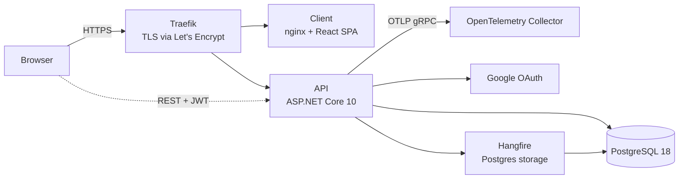

# Finora

A fast, minimal, fintech-ledger style personal finance app for tracking expenses, income, credit cards and monthly category budgets. Built full-stack: **React 19 + TypeScript** client, **.NET 10 Clean Architecture** API, **PostgreSQL**, shipped through a **GitHub Actions → GHCR → Traefik** pipeline with **OpenTelemetry** instrumentation.

> Design priority: **fast data entry**. Logging a transaction should take about three interactions (amount → category → Enter).

| Environment | Branch | Client | API |
|-------------|--------|--------|-----|
| Production | `main` | [finora.efficanova.com](https://finora.efficanova.com/) | [api-finora.efficanova.com](https://api-finora.efficanova.com/) |
| Development | `dev` | [finora-dev.efficanova.com](https://finora-dev.efficanova.com/) | [api-finora-dev.efficanova.com](https://api-finora-dev.efficanova.com/) |

Each environment has its own database, secrets and API URL (baked into the client image at build time).

---

## Highlights

- **Correct money handling**: amounts are integers in minor units, always positive (the transaction type carries direction), and balances are *derived* from transactions, never stored, so they cannot drift.
- **Credit card model**: card purchases count as expenses in the purchase month; paying the bill is a *Transfer*, so spending is never double-counted. Cards show outstanding, available credit and next due date.
- **Strict per-user isolation, enforced twice**: every query is scoped to the user in application code, and composite foreign keys `(user_id, id)` in Postgres prevent a row from referencing another user's account or category even if app code has a bug.
- **Google sign-in (OAuth 2.0 + PKCE)** with short-lived JWT access tokens and an HttpOnly refresh-token cookie.
- **Approval-based access control**: new users land in *Pending* until the admin approves them; admins can suspend, reactivate and remove members, with an audit log. Admins manage accounts, never finances.
- **Optimistic UI** for transactions, accounts and member actions, plus keyboard shortcuts and a quick-add sheet available on every screen.
- **Reports and export**: spending by category, budget vs actual, income vs expense by month, and Excel (.xlsx) export that respects active filters.
- Light/dark theme, compact/comfortable density, responsive layout.

## Features

| Area | What it does |
|------|--------------|
| **Dashboard** | KPIs (spent, income, net savings, budget remaining, card outstanding, total balance), income vs expense chart, top categories, budgets at risk, upcoming card dues |
| **Transactions** | Server-side paginated/sorted/filtered table (date, account, category, type, amount, search), bulk delete and re-categorize, soft delete, Excel export |
| **Accounts** | Bank, Cash, Wallet, Credit Card; reorder; archive/restore; "Pay card" transfer flow |
| **Categories** | Per-user copies of seeded defaults, one level of sub-categories, color/icon pickers, archive/restore |
| **Budgets** | Monthly per-category budgets, normal / warning (80%) / over (100%) states, copy from previous month |
| **Reports** | Shared date-range filter (1, 3, 6, 9, 12 months or custom), Excel export |
| **Settings** | Profile, preferences (theme, density), data export, delete account |
| **Access (admin)** | Member approval queue, suspend / reactivate / remove, audit log, signup settings |

Product scope and domain rules are in [docs/project-overview.md](docs/project-overview.md); the schema is in [docs/data-model.md](docs/data-model.md).

---

## Architecture



### Backend (`server/`)

Plain layered **Clean Architecture**. Controllers call services directly: no MediatR, no CQRS.

```
MoneyManagement.Domain          entities, enums, domain exceptions (no dependencies)
MoneyManagement.Application     feature services, DTOs, requests, FluentValidation validators,
                                repository interfaces, Result<T>, pure money/date math
MoneyManagement.Infrastructure  EF Core + Npgsql, repositories, Unit of Work, JWT + Google OAuth,
                                Excel export, health checks, migrations
MoneyManagement.Api             controllers, middleware, filters, DI/startup extensions
```

Application features are vertical slices: `Access`, `Accounts`, `Auth`, `Budgets`, `Categories`, `Dashboard`, `Reports`, `Settings`, `Transactions`. Each has `Dto/`, `Requests/`, `Interfaces/`, `Services/` and `Validators/`.

Key design decisions:

- **`Result<T>` everywhere.** Services return `Result<T>` and the API converts it to an HTTP response with one `ToActionResult()` extension, so controllers contain no business logic.
- **Uniform response envelope.** `ApiResponse<T>` and an `ErrorStatus` enum are mirrored exactly by the client's types.
- **Per-entity repositories.** Services depend on named repository methods (`ITransactionRepository`, `IAccountRepository`, ...) rather than raw predicates on a generic repository.
- **Layer boundaries are hard rules.** Application has no `DbContext`, no EF types and no `HttpContext`; Infrastructure holds no business rules; the API holds only HTTP concerns.
- **Cross-cutting concerns in the pipeline**: a global exception-handling middleware, a validation filter (FluentValidation), and a user-status middleware that blocks pending/suspended users on every request.
- **Self-bootstrapping**: migrations are applied and the admin user is seeded at startup.
- **API docs**: OpenAPI document plus Swagger UI.
- **Background jobs**: Hangfire with PostgreSQL storage (dashboard enabled in Development only).

### Frontend (`client/`)

Feature-folder architecture; every feature is self-contained and generated by `npm run gen <feature-name>`.

```
src/
  api/          axios instance + interceptors, React Query client
  ui/           shadcn/ui primitives only
  components/   shared building blocks (DataTable, layout shell, pickers, charts cards)
  store/        Zustand stores for client-only state (auth, theme, density, UI)
  features/<name>/
    api/        raw axios calls
    hooks/      queries/ and mutations/ (React Query wrappers)
    components/ schemas/ types/ pages/ constants/
    index.ts    barrel: the only public surface of the feature
```

Principles: server state lives in **TanStack Query** (never in Zustand); forms use **React Hook Form + Zod**; no feature imports another feature's internals; types mirror the backend contract; mutations use optimistic updates with rollback.

### Data model

Core tables: `users`, `user_settings`, `accounts`, `categories`, `transactions`, `budgets`, `refresh_tokens`, `app_settings`, `admin_audit_log`. User-owned tables carry `user_id`; transactions are soft-deleted, accounts and categories are archived. Details and ER diagram: [docs/data-model.md](docs/data-model.md).

---

## Observability and operations

- **OpenTelemetry** (traces, metrics, logs) wired through `AddObservability()`:
  - Traces: ASP.NET Core, HttpClient and Npgsql instrumentation (health checks filtered out).
  - Metrics: ASP.NET Core, HttpClient, .NET runtime and Npgsql meters.
  - Logs: `ILogger` bridged to OpenTelemetry with scopes and formatted messages.
  - Exported over **OTLP/gRPC** only when `OTEL_EXPORTER_OTLP_ENDPOINT` is set, so local runs need no collector. In deployment the API joins an external `observability` Docker network to reach the collector.
- **Health endpoints**: `/health` (all checks), `/health/ready` (readiness, includes a database check), `/health/live` (liveness, no dependencies).
- **Hangfire dashboard** for background jobs in Development.
- **Structured error handling**: all unhandled exceptions are converted to the standard `ApiResponse` error shape by middleware.

## CI/CD and deployment

[`.github/workflows/cicd.yml`](.github/workflows/cicd.yml):

1. **Build**: on every push/PR to `main` or `dev`, builds the API and client Docker images with Buildx and GitHub Actions layer caching. PRs only verify the build; pushes publish to **GitHub Container Registry** tagged `latest` (main) or `dev` (dev), plus an immutable `sha-<commit>` tag.
2. **Deploy**: on push only, SSHes to the server, then `docker compose pull && up -d` in the environment's directory and prunes old images. Deploys are serialized per branch (`concurrency`) and never cancelled mid-flight; GitHub Environments separate production and development.
3. **Runtime**: Traefik terminates TLS (Let's Encrypt) and routes by host to the nginx-served SPA and the API. The client image is a multi-stage build (Node → nginx) with the API URL baked in at build time; the API image is a multi-stage build (.NET SDK → ASP.NET runtime).

| Branch | Image tag | Environment |
|--------|-----------|-------------|
| `main` | `latest` | production |
| `dev` | `dev` | development |

---

## Tech stack

**Frontend:** React 19, TypeScript 6, Vite 8, Tailwind CSS 4, shadcn/ui (Radix), TanStack Query, TanStack Table, React Router 7, React Hook Form, Zod 4, Zustand, Recharts, axios, date-fns, Sonner, Oxlint

**Backend:** .NET 10 / ASP.NET Core, EF Core 10 + Npgsql, FluentValidation, Mapster, ClosedXML (Excel), Hangfire, JWT bearer auth, Google.Apis.Auth, Swagger UI

**Data:** PostgreSQL 18

**Observability:** OpenTelemetry (OTLP exporter, ASP.NET Core / HttpClient / Npgsql / runtime instrumentation), ASP.NET health checks

**Infra / DevOps:** Docker, Docker Compose, nginx, Traefik, GitHub Actions, GitHub Container Registry

**Testing:** xUnit with EF Core InMemory, covering the money-critical logic: account balance math, card payments, budgets, dashboard and report totals, transaction rules and filters, settings, and access control.

---

## Getting started

### Prerequisites

Node.js, the .NET 10 SDK, Docker (for Postgres), and a Google OAuth client (ID and secret).

### 1. Database

```bash
cp .env.example .env          # set POSTGRES_USER / PASSWORD / DB
docker compose up -d postgres
```

### 2. API

```bash
cd server/src/MoneyManagement.Api
cp .env.example .env          # connection string, JWT signing key, Google OAuth, admin email
dotnet run
```

The API applies migrations and seeds the admin user on startup. Swagger UI is served at `/swagger`.

### 3. Client

```bash
cd client
npm install
npm run dev                   # http://localhost:5173
```

Set `VITE_API_BASE_URL` to point the client at the API.

### Full stack in Docker

```bash
docker compose up --build     # client :81, API :8081, Postgres :5432
```

(The compose file expects the external `observability` Docker network; create it with `docker network create observability` if you are not running a collector.)

### Tests

```bash
cd server && dotnet test
```

---

## Repository layout

```
client/    React SPA (see client/CLAUDE.md for conventions)
server/    .NET solution: src/ and tests/ (see server/Claude.md for conventions)
docs/      project overview and data model
.github/   CI/CD workflows
docker-compose.yml        local full stack
docker-compose.dev.yml    dev environment (images from GHCR, Traefik labels)
```
