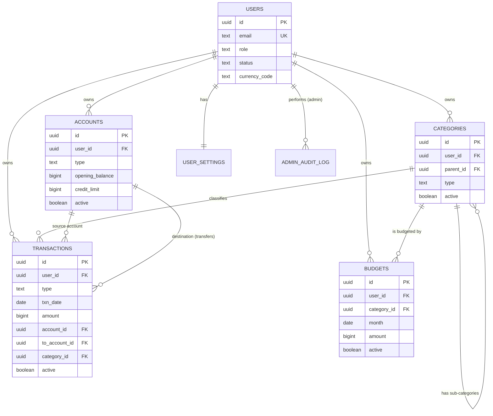

# Data Model: Expense & Budget Tracker

Target: PostgreSQL (works the same on SQL Server with type swaps). Companion to `project-overview.md`.

---

## 1. Design principles

| Principle | How it shows up |
|-----------|-----------------|
| **Every row belongs to a user** | `user_id` on every data table; every query is scoped to it. |
| **Isolation enforced by the database, too** | Composite foreign keys `(user_id, id)` stop a transaction from pointing at another user's account or category, even if app code has a bug. |
| **Money is exact** | Amounts are `bigint` in minor units (paise/cents), never floats. Currency lives on the user. |
| **Balances are derived** | No stored balance columns. Balances and card outstanding are computed from transactions, so they cannot drift. |
| **Amounts are always positive** | The transaction `type` carries the direction. |
| **Dates are calendar dates** | `date` columns, not timestamps, to avoid wrong-day bugs. `created_at`/`modified_at` are UTC `timestamptz`. |
| **One `active` flag** | Tables that inherit the base entity use `active` instead of separate delete/archive columns. `active = false` means deleted (transactions) or archived (accounts, categories). |
| **Phase 3 is pre-wired** | `role` and `status` exist on `users` from day one, defaulting to `User` / `Approved`. |

### 1.1 Base entity

```csharp
public abstract class BaseEntity
{
    public Guid Id { get; set; }
    public bool Active { get; set; } = true;
    public DateTime CreatedAt { get; set; }      // UTC
    public DateTime? ModifiedAt { get; set; }    // UTC, null = never edited
}

// Separate interface, so the user filter applies only to user-owned tables
public interface IUserOwned { Guid UserId { get; set; } }
```

| Table | Inherits `BaseEntity`? | Why |
|-------|------------------------|-----|
| `accounts`, `categories`, `transactions`, `budgets` | Yes (and `IUserOwned`) | Standard user-owned data |
| `users` | No | Inherits `IdentityUser<Guid>` (one base class only). `created_at` and `modified_at` are added directly; account state is tracked by `status`. |
| `user_settings` | No | Primary key is `user_id`; no lifecycle needed |
| `admin_audit_log` | No | Append-only |

**Query filters**
- **`UserId` filter:** global, on every `IUserOwned` entity, so no endpoint can forget it.
- **`Active` filter:** global on **transactions only**. Accounts, categories and budgets are *not* filtered globally, because an archived category must still show its name on old transactions and in reports, and an archived card still needs its balance. Filter them explicitly where you want active ones only (for example the quick-add dropdowns).
- **Raw SQL bypasses both filters.** Keep `user_id = @user` and `active` in every report query (see section 6) and cover them with tests.

**Timestamps and IDs**
- A `SaveChangesInterceptor` sets `CreatedAt` on insert and `ModifiedAt` on update. `UserId` is stamped from an `ICurrentUser` service.
- There is no `created_by` / `modified_by`: the owner is always `UserId`, and Phase 3 admin actions are recorded in `admin_audit_log`.
- IDs are time-ordered GUIDs (`Guid.CreateVersion7()` on .NET 9), which are kind to indexes and can be generated on the client for the optimistic UI.

---

## 2. Entity relationship diagram



---

## 3. Tables

### 3.1 `users`
Maps onto ASP.NET Core Identity's user table (extra columns added to it). It does not use `BaseEntity`. Identity also creates its own tables for tokens and logins; those are not repeated here.

| Column | Type | Notes |
|--------|------|-------|
| `id` | uuid PK | |
| `name` | text | |
| `email` | citext, unique | Case-insensitive |
| `password_hash` | text | Managed by Identity |
| `role` | text | `User` (default) or `Admin`. Check constraint. |
| `status` | text | `Pending`, `Approved` (default), `Rejected`, `Suspended`. Ignored in Phase 1, enforced in Phase 3. |
| `rejection_reason` | text null | Phase 3 |
| `currency_code` | char(3) | Chosen at signup, for example `INR` |
| `timezone` | text | IANA name, for example `Asia/Kolkata`. Used to decide "this month". |
| `email_verified_at` | timestamptz null | |
| `last_login_at` | timestamptz null | |
| `created_at` | timestamptz | UTC |
| `modified_at` | timestamptz null | Null = never edited |

### 3.2 `user_settings`
One row per user. Holds UI preferences and the smart defaults that make quick-add fast.

| Column | Type | Notes |
|--------|------|-------|
| `user_id` | uuid PK, FK → users | |
| `theme` | text | `light`, `dark`, `system` |
| `density` | text | `compact`, `comfortable` |
| `last_used_account_id` | uuid null | Default account for the next entry |
| `last_used_type` | text null | Default transaction type for the next entry |

### 3.3 `accounts`
Bank, Cash, Wallet and Credit Card accounts.

| Column | Type | Notes |
|--------|------|-------|
| `id` | uuid PK | |
| `user_id` | uuid FK → users | |
| `name` | text | Unique per user among active accounts |
| `type` | text | `Bank`, `Cash`, `Wallet`, `CreditCard` |
| `opening_balance` | bigint | **Signed.** For a card, enter the opening amount owed as a negative number (the app converts). |
| `credit_limit` | bigint null | Cards only |
| `statement_day` | smallint null | 1–28, cards only |
| `due_day` | smallint null | 1–28, cards only |
| `color` | text null | |
| `sort_order` | int | |
| `active` | boolean | Default true (from `BaseEntity`). `false` = archived. Accounts with history are archived, not deleted. |
| `created_at` | timestamptz | UTC |
| `modified_at` | timestamptz null | Null = never edited |

Constraints: `credit_limit`, `statement_day` and `due_day` are only allowed when `type = 'CreditCard'`. Unique `(user_id, id)` so other tables can reference it with a composite FK.

### 3.4 `categories`
Categories and sub-categories in one table, using a self-reference.

| Column | Type | Notes |
|--------|------|-------|
| `id` | uuid PK | |
| `user_id` | uuid FK → users | Each user owns a copy of the defaults |
| `parent_id` | uuid null | Null = top-level category. Set = sub-category. |
| `name` | text | Unique per `(user_id, parent_id)` among active rows |
| `type` | text | `Expense` or `Income`. A sub-category must match its parent. |
| `color`, `icon` | text null | |
| `sort_order` | int | |
| `active` | boolean | Default true (from `BaseEntity`). `false` = archived |
| `default_key` | text null | Set on seeded rows (for example `food`), so the app can recognise defaults without relying on names |
| `created_at` | timestamptz | UTC |
| `modified_at` | timestamptz null | Null = never edited |

Rules:
- **One level only:** the parent of a sub-category must itself have `parent_id IS NULL`. Enforce in the app, and with a trigger if you want database-level safety.
- **Same type as parent:** enforced the same way.
- **Category totals include sub-categories:** report queries roll a sub-category up to its parent (see section 6).
- **Deleting a used category** is blocked at the app level: the user must reassign its transactions or archive it. The FK from `transactions` uses `ON DELETE RESTRICT` as a backstop.

### 3.5 `transactions`
The heart of the app: income, expenses and transfers.

| Column | Type | Notes |
|--------|------|-------|
| `id` | uuid PK | Can be generated on the client to support optimistic UI |
| `user_id` | uuid FK → users | |
| `type` | text | `Income`, `Expense`, `Transfer` |
| `txn_date` | date | Purchase date. Card purchases count in this month. |
| `amount` | bigint | Always > 0, in minor units |
| `account_id` | uuid | Source account (where money is spent, received or leaves from) |
| `to_account_id` | uuid null | Transfers only: the destination (for a card payment, the card) |
| `category_id` | uuid null | Category or sub-category. Required for Income and Expense, null for Transfer. |
| `description` | text null | Merchant or short note, used for autocomplete |
| `notes` | text null | Longer free text |
| `active` | boolean | Default true. `false` = soft-deleted (the undo toast flips it back); `modified_at` records when. |
| `created_at` | timestamptz | UTC |
| `modified_at` | timestamptz null | Null = never edited |

Check constraints:
```
amount > 0
type = 'Transfer'  → to_account_id IS NOT NULL AND to_account_id <> account_id AND category_id IS NULL
type <> 'Transfer' → to_account_id IS NULL AND category_id IS NOT NULL
```

Composite FKs: `(user_id, account_id)`, `(user_id, to_account_id)` and `(user_id, category_id)` reference the matching `(user_id, id)` unique keys on `accounts` and `categories`.

Additional rule (app level): an Income or Expense category must match the transaction's type (an Expense cannot use an Income category).

### 3.6 `budgets`
One row per category per month.

| Column | Type | Notes |
|--------|------|-------|
| `id` | uuid PK | |
| `user_id` | uuid FK → users | |
| `category_id` | uuid | Category or sub-category. Expense categories only. |
| `month` | date | Always the first day of the month |
| `amount` | bigint | Budget in minor units (>= 0) |
| `created_at` | timestamptz | UTC |
| `modified_at` | timestamptz null | Null = never edited |

Unique `(category_id, month) WHERE active`.

**Carry-forward:** when a user first opens a month that has no budget rows, the app copies the previous month's rows into it. Users can then edit that month independently. This keeps report queries simple, because budget vs actual is a plain join on `month`, even across 12 months.

There is **no overall monthly cap** row. "Budget remaining" on the dashboard is the sum of category budgets minus spending in those categories.

### 3.7 `admin_audit_log` (Phase 3)

| Column | Type | Notes |
|--------|------|-------|
| `id` | uuid PK | |
| `admin_user_id` | uuid FK → users | Who acted |
| `action` | text | `approve`, `reject`, `suspend`, `reactivate`, `delete_user`, `force_password_reset`, `toggle_signups` |
| `target_user_id` | uuid null | **No FK**, so the log survives deleting the user |
| `target_email` | text null | Snapshot at the time of the action |
| `details` | jsonb null | For example the rejection reason |
| `created_at` | timestamptz | |

### 3.8 Optional: `app_settings` (Phase 3)
A tiny key/value table for global switches such as `signups_open`.

### 3.9 Optional: `description_hints` (performance only)
Autocomplete can start as a query over `transactions` (see section 6). If it gets slow, add this derived table.

| Column | Type |
|--------|------|
| `user_id`, `description_key` | composite PK (`description_key` is the lowercased, trimmed description) |
| `display_text` | text |
| `last_category_id`, `last_account_id` | uuid |
| `use_count` | int |
| `last_used_at` | timestamptz |

---

## 4. Derived values (never stored)

**Sign convention:** every account has a signed balance. Credit cards normally go negative.

```
balance(account) = opening_balance
                 + Σ Income     where account_id = account
                 − Σ Expense    where account_id = account
                 − Σ Transfer   where account_id = account      (money leaves)
                 + Σ Transfer   where to_account_id = account   (money arrives)
```
(all over active transactions)

| Value | Formula |
|-------|---------|
| Card outstanding | `−balance` |
| Card available credit | `credit_limit − outstanding` |
| Card payment | A Transfer with `account_id` = bank, `to_account_id` = card. Outstanding drops, the bank balance drops, and nothing counts as spending. |
| Total balance (dashboard) | Sum of balances over non-card, active accounts |
| Total card outstanding | Sum of outstanding over card accounts |
| Spent this month | Σ Expense in the month. Transfers excluded. |
| Budget % used | `spent / budget`. Warning at 80%, over at 100%. |

---

## 5. Indexes

| Index | Purpose |
|-------|---------|
| `transactions (user_id, txn_date DESC) WHERE active` | Transactions page, date filters, recent transactions |
| `transactions (user_id, account_id, txn_date)` | Account balances and per-account filters |
| `transactions (user_id, to_account_id) WHERE to_account_id IS NOT NULL` | Card payments and incoming transfers |
| `transactions (user_id, category_id, txn_date)` | Category reports and budget vs actual |
| `transactions (user_id, lower(description))` (or trigram) | Description autocomplete and search |
| `categories (user_id, parent_id)` | Building the category tree |
| `budgets (user_id, month)` | Loading a month's budgets |

At 10,000+ rows per user these are more than enough. Balances can be computed live with a single aggregate query.

---

## 6. Key queries (sketches)

**Spending by category, rolled up to top-level** (report: where did I spend the most)
```sql
SELECT COALESCE(c.parent_id, c.id) AS category_id,
       SUM(t.amount)               AS spent
FROM transactions t
JOIN categories c ON c.id = t.category_id
WHERE t.user_id = @user
  AND t.type = 'Expense'
  AND t.active
  AND t.txn_date BETWEEN @from AND @to
GROUP BY COALESCE(c.parent_id, c.id)
ORDER BY spent DESC;
```

**Income vs expense by month** (bar chart)
```sql
SELECT date_trunc('month', txn_date)::date AS month,
       SUM(amount) FILTER (WHERE type = 'Income')  AS income,
       SUM(amount) FILTER (WHERE type = 'Expense') AS expense
FROM transactions
WHERE user_id = @user AND active
  AND txn_date BETWEEN @from AND @to
GROUP BY 1
ORDER BY 1;
```

**Budget vs actual for a month** (category level, sub-categories rolled up)
```sql
SELECT b.category_id,
       b.amount AS budgeted,
       COALESCE(s.spent, 0) AS spent
FROM budgets b
LEFT JOIN (
    SELECT COALESCE(c.parent_id, c.id) AS category_id, SUM(t.amount) AS spent
    FROM transactions t
    JOIN categories c ON c.id = t.category_id
    WHERE t.user_id = @user AND t.type = 'Expense' AND t.active
      AND t.txn_date >= @month AND t.txn_date < @month + interval '1 month'
    GROUP BY 1
) s ON s.category_id = b.category_id
WHERE b.user_id = @user AND b.month = @month;
```

**Account balance**
```sql
SELECT a.id,
       a.opening_balance
     + COALESCE(SUM(CASE
         WHEN t.account_id = a.id AND t.type = 'Income'   THEN  t.amount
         WHEN t.account_id = a.id AND t.type = 'Expense'  THEN -t.amount
         WHEN t.account_id = a.id AND t.type = 'Transfer' THEN -t.amount
         WHEN t.to_account_id = a.id                      THEN  t.amount
       END), 0) AS balance
FROM accounts a
LEFT JOIN transactions t
  ON t.user_id = a.user_id
 AND t.active
 AND (t.account_id = a.id OR t.to_account_id = a.id)
WHERE a.user_id = @user
GROUP BY a.id, a.opening_balance;
```

**Description autocomplete** (start simple)
```sql
SELECT description, category_id, account_id
FROM (
    SELECT DISTINCT ON (lower(description))
           description, category_id, account_id, txn_date
    FROM transactions
    WHERE user_id = @user AND active
      AND description ILIKE @prefix || '%'
    ORDER BY lower(description), txn_date DESC
) x
ORDER BY txn_date DESC
LIMIT 8;
```

---

## 7. Default category seed

Copied per user at signup from application config (not from a shared table), then editable.

| Type | Category | Sub-categories (examples) |
|------|----------|---------------------------|
| Expense | Food | Groceries, Dining out, Coffee & snacks |
| Expense | Transport | Fuel, Public transport, Taxi |
| Expense | Rent & Housing | Rent, Maintenance, Furnishing |
| Expense | Bills & Utilities | Electricity, Internet, Mobile, Subscriptions |
| Expense | Shopping | Clothing, Electronics, Household |
| Expense | Health | Doctor, Medicine, Fitness |
| Expense | Entertainment | Movies, Games, Travel |
| Expense | Fees & Interest | Card fees, Interest, Bank charges |
| Expense | Other | |
| Income | Salary | |
| Income | Freelance | |
| Income | Interest & Returns | |
| Income | Other Income | |

Each seeded row gets a `default_key`, so the app can find "the Fees & Interest category" even after the user renames it.

---

## 8. Integrity rules summary

1. Amount is always greater than zero.
2. Transfers have a destination different from the source, and no category.
3. Income and Expense have a category and no destination account.
4. Category type must match transaction type; sub-category type must match its parent.
5. Categories nest one level only.
6. Accounts, categories and transactions can only reference rows owned by the same user (composite FKs).
7. Budgets are unique per category per month, and only for Expense categories.
8. Used categories and accounts are archived (`active = false`), not deleted. Deleted transactions are `active = false`.
9. Deleting a user cascades to all of their data (`ON DELETE CASCADE` from `users`), except audit log entries, which are kept.

---

## 9. Open points

- **Refunds:** the simplest option is to log a refund as Income in an "Other Income" or "Refunds" category. The catch is that it inflates income slightly and does not reduce the original category's spending. The alternative is a fourth transaction type, which adds complexity, so it is not proposed for v1.
- **Opening balance for cards** is entered as an amount owed and stored negative. The UI should hide that sign convention from the user.
- **Whether to use a Postgres trigger** for the one-level and same-type category rules, or keep them in application code only.